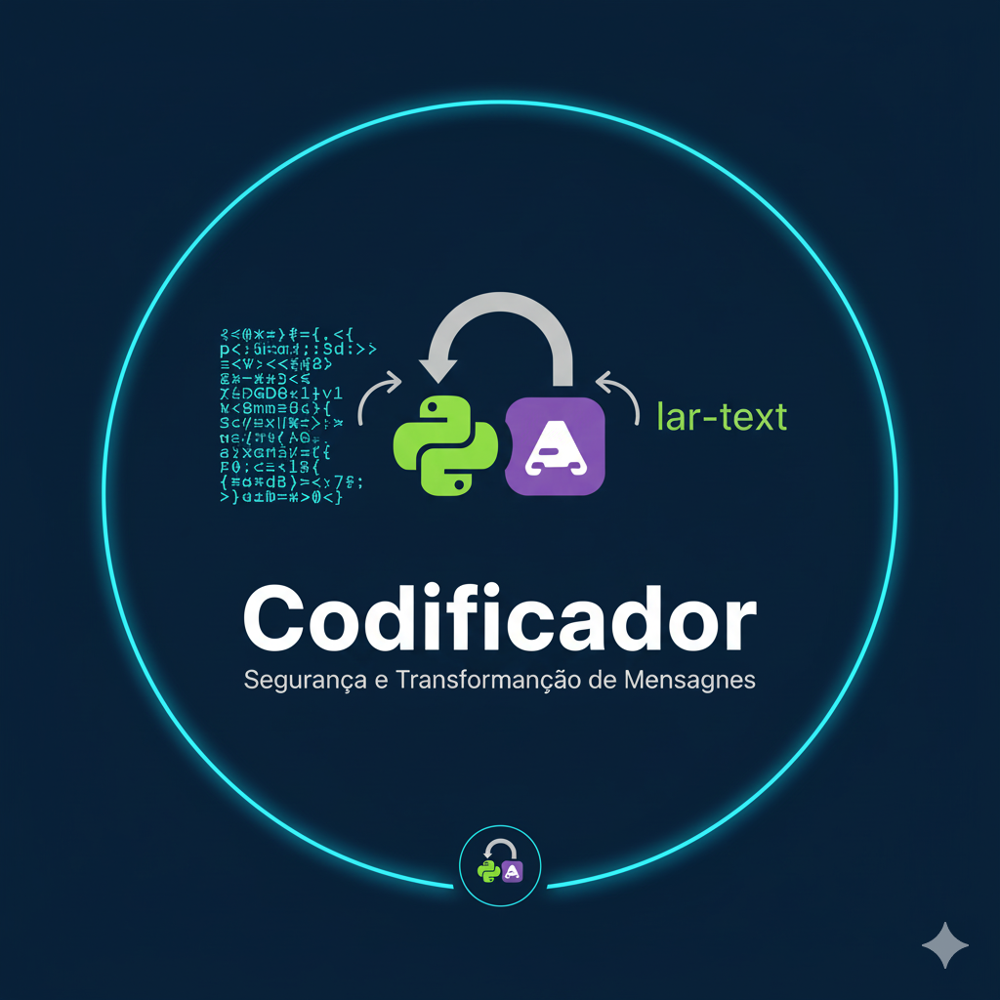

# 🔐 Codificador

<p align="center">
  
</p>

Bem-vindo ao **Codificador**, uma aplicação web desenvolvida com Python e Flask que permite codificar e decodificar mensagens utilizando algoritmos simples de substituição. Este projeto tem como objetivo demonstrar como construir aplicações web interativas com Flask e manipulação de strings.

---

## 🔧 Funcionalidades

- **Codificação**: Codifica mensagens inseridas pelo usuário utilizando um algoritmo de substituição.
- **Decodificação**: Decodifica mensagens codificadas para o formato original.
- **Interface Web**: Interface simples e intuitiva para interação com o usuário.

---

## 🛠️ Tecnologias Utilizadas

- **Python**: Linguagem de programação principal.
- **Flask**: Framework web para desenvolvimento da aplicação.
- **HTML/CSS/JavaScript**: Tecnologias utilizadas para construção da interface do usuário.

---

## 🚀 Como Executar

1. Clone este repositório:
   ```bash
   git clone https://github.com/Gabrielli-Rech/Codificador.git
   
2. Navegue até a pasta do projeto:
  cd Codificador

3. Instale as dependências:
  pip install -r requirements.txt

4. Execute o servidor Flask:
  python app.py

5. Abra o navegador e acesse:
  http://127.0.0.1:5000

6. Siga as instruções na interface para codificar ou decodificar mensagens.


---

## 📂 Estrutura do Projeto<br>

Codificador/<br>
├── app.py                  # Script principal da aplicação Flask<br>
├── static/                 # Arquivos estáticos (CSS, JavaScript)<br>
├── templates/              # Templates HTML<br>
├── requirements.txt        # Dependências do projeto<br>
└── README.md               # Este arquivo<br>

